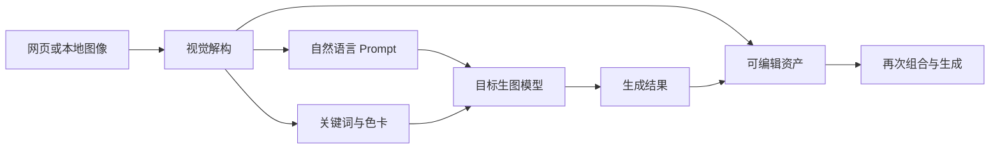
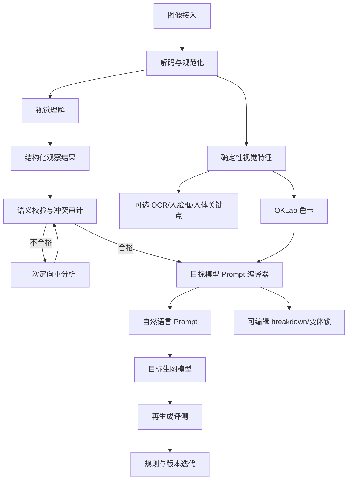

# Viko 图片反推提示词：技术深度调研与可复刻蓝图

> 调研日期：2026-08-17（Asia/Shanghai）
> 调研范围：Viko 官网、使用文档、Chrome Web Store、公开 CRX 1.0.2、公开配置接口、提示词反演论文与主流多模态 API 文档。
> 边界：未登录 Viko、未上传图片、未调用付费反推或生图服务、未探测非公开接口。附件《Viko 图片反推提示词技术深度调研与复刻方案.md》只作为参考材料，本文对其中结论进行了独立核验。

## 1. 结论先行

Viko 的核心并不是一个神秘的“原始 Prompt 还原模型”，而是一个**图像到生成控制语言的编译系统**：

1. 用视觉大模型判断图像类型并提取多维视觉事实；
2. 用类型专用规则把事实编译成面向生图模型的自然语言提示词；
3. 用结构化中间结果支撑拆解面板、编辑、变体和资产化；
4. 用确定性像素算法提取色卡，避免大模型猜颜色；
5. 用任务调度、积分、历史和生成接口把反推结果变成可持续复用的创作资产。

最值得复刻的不是浏览器悬浮球，也不是 Viko 当前使用的某个模型别名，而是下面四项工程资产：

- **可观察事实与生成性措辞分离**；
- **按图像类型路由的视觉维度和 Prompt 编译规则**；
- **内部严格结构化、外部自然语言的双层输出契约**；
- **用“再生成结果”而不是 Prompt 文采来做质量闭环**。

研究也给出一个重要反面结论：不要把 CLIP 相似度优化当成核心算法。已有 prompt recovery 对比研究发现，优化“反推文本与目标图的 CLIP 相似度”并不能可靠代理“用反推文本再生成后，与目标图有多像”；训练良好的 captioner 往往反而生成更接近的图像。[Prompt Recovery comparative study](https://arxiv.org/abs/2408.06502)

## 2. 证据等级与对 Manus 附件的复核

### 2.1 证据等级

| 等级 | 证据 | 可以证明 | 不能证明 |
|---|---|---|---|
| A1 | Viko 公开 CRX 1.0.2 源码 | 发布版客户端的数据流、接口路径、默认配置、色卡算法、客户端保留的提示规则 | 云端实际系统提示词、供应商真实模型、私有路由逻辑 |
| A2 | 官网、文档、商店页 | 对用户承诺的功能、UI 输出、价格与数据处理声明 | 内部模型和算法实现 |
| A3 | `GET /api/auth/config` 公开响应 | 当前下发的模型别名、默认模型、Supabase 鉴权配置存在 | 别名背后的实际供应商与权重 |
| B | 官方模型/API 文档 | 可复刻技术能力是否真实可用 | Viko 是否使用该官方接口 |
| C | 论文与开源基线 | prompt inversion 的边界、可行方法与评测缺陷 | Viko 私有服务端采用了哪篇论文的方法 |
| D | 工程推断 | 可落地的复刻设计 | 不应写成 Viko 已证实事实 |

### 2.2 附件中已确认的结论

- Chrome 扩展为 Manifest V3，后台为 `src/background.js`，内容脚本覆盖 `<all_urls>`。
- 云端 API 基址为 `https://api.viko.fun`，核心反推路径为 `POST /api/reverse`。
- 客户端和云端契约包含 `prompt`、`variantPrompt`、`breakdown`、`imageType`、`colorPalette` 等概念。
- 反推按图像类型处理，公开代码中的枚举包括摄影人像、动漫插画、海报设计、商业产品、静物、空间景观、UI/信息图和混合类型。
- 色卡确实由客户端确定性算法提取，并在云端模式下作为 `extractedColorPalette` 发送。
- 动漫提示词存在明确的风格冲突检测和一次定向修复代码。

### 2.3 必须修正或收紧的结论

| 附件说法 | 独立复核后的结论 |
|---|---|
| Viko 当前使用六个视觉模型候选 | CRX 内置候选确有六个；但 2026-08-17 的公开配置接口只下发 `gpt-5.5`、`gpt-5.6-sol`，默认 `gpt-5.6-sol`。内置列表不能代表当前生产路由。 |
| 客户端公开提示词就是线上生产提示词 | 发布版 `getSettings()` 强制 `serviceMode: "cloud"`，同时清空供应商 endpoint/API key、关闭自定义提示词。云端请求不携带这段系统提示词。因此它能证明设计思想和历史/直接模式实现，不能证明后端逐字使用。 |
| 整个系统是云端异步任务系统 | 更准确地说是**混合式**：`POST /api/reverse` 的 HTTP 超时约 185 秒，返回值既可能是结果，也可能是可继续轮询的 durable queue ticket；插件随后会执行 queue wait/recovery。生图则明确采用 `/api/image/start` + 状态查询。 |
| Viko 对外返回 JSON Prompt | 官网明确写“绝对不用 JSON”。正确理解是：内部结构化 JSON 用于程序消费，UI 展示和可复制资产是自然语言 Prompt。 |
| 动漫冲突修复已证实在线上执行 | 已证实代码存在且在非云端直连路径执行；发布版强制云端，无法从客户端证明云端也执行同一段修复。复刻时值得采用，但应标记为工程建议。 |

### 2.4 无法从公开证据证明的事项

- 云端是否对视觉模型做了微调、蒸馏或 LoRA；
- 云端是否使用多 Agent、多轮 VLM、自研视觉编码器或 CLIP reranking；
- `gpt-5.6-sol` 等 Viko 模型别名背后的供应商、参数规模和实际版本；
- 云端系统提示词是否与 CRX 中保留的内置模板相同；
- Viko 宣称的“高精度”是只增加输出预算、改提示词，还是会切模型/增加轮次。

## 3. 产品行为：Viko 真正卖的是什么

官网将反推定位为“输出适合 GPT 图像模型的自然语言提示词，服务于创作，不追求机械还原”，并展示九个用户维度：风格类型、构图方式、光线设计、色彩关系、成像质感、主体与背景关系、镜头语言、氛围情绪、可迁移视觉关键词。[Viko 产品页](https://viko.fun/product)

使用文档确认：普通反推 1 积分，高精度 2 积分；可选提示词变体；色卡模式免费；动作参考与生图分别计费；任务在云端运行且支持历史恢复。[Viko 文档](https://viko.fun/docs) [Viko 定价](https://viko.fun/pricing)

Chrome 商店页进一步列出图像类型、风格、构图、机位、主体、姿态、表情、服装、场景、光线、颜色、材质和渲染质感，并公开异步队列、历史、收藏和云同步等能力。商店当前显示版本 1.0.2、更新时间 2026-08-13、512 用户，并披露会处理身份、支付、鉴权、网页历史、用户活动和网站内容等数据类别。[Chrome Web Store](https://chromewebstore.google.com/detail/viko-image-to-prompt-ai-i/empmikpppipkdkchcjlhbljcinagalnn)

其产品飞轮可以抽象为：



这解释了为什么“结构化拆解”比一条长 caption 更重要：它让用户能修改一个维度、锁住其余维度，并把提示词、色卡、来源和结果继续复用。

## 4. 已证实的客户端技术实现

### 4.1 采集与数据流

公开扩展会从网页图片候选 URL、本地上传或缓存中取得图像。云端反推负载包含：

```text
mode, workflowMode, taskIndex, taskCreatedAt,
imageData, pageSourceUrl, localTaskId, creditRunId,
uiLanguage, visionModel, imageSize/requestedImageSize/resolvedImageSize,
paletteModeEnabled, paletteReferenceEnabled, extractedColorPalette,
promptPrecision, variantPromptEnabled, showBreakdown
```

关键含义：

- 上传的是被选中的图像数据，不是整页 DOM；来源 URL 会先清洗。
- 图像以 Data URL 进入云端路径，客户端上限常量为 2,800,000 字符，约等于 2.1 MB 二进制负载量级。
- 对过大、受保护或跨域失败的网页图片，客户端会尝试多个候选；全部失败后要求用户上传，并没有在这条路径里通用地自动压缩原图。
- 色卡与 VLM 分析不是同一个模型输出；色卡先在客户端计算，再随反推请求发送。

复刻时不建议照搬 Data URL 作为长期接口。更稳健的做法是：浏览器先把图像上传到短期对象存储，反推任务只传对象 ID、内容哈希和已验证的元数据；MVP 若直接传 multipart，也要显式限制像素、解码后尺寸和文件格式。

### 4.2 云端与鉴权

扩展使用 `https://api.viko.fun`，公开路由可见：

- `/api/auth/config`
- `/api/reverse`
- `/api/image/start`
- `/api/image/pose-reference/start`
- `/api/queue/status`、`/api/queue/cancel`
- `/api/credits/prepare`、`/api/credits/finalize`
- `/api/tasks/history`
- `/api/keywords`、`/api/palettes`、`/api/favorites`

公开配置表明鉴权使用 Supabase，客户端获取 publishable 配置后执行登录与 token refresh。当前模型配置可直接在[Viko 公开配置接口](https://api.viko.fun/api/auth/config)核验。由于这些只是 Viko 自定义别名，不能把 `gpt-5.6-sol` 自动等同于某个公开供应商模型。

### 4.3 混合任务调度

反推链路不是简单的“发一个 fetch 等结果”，也不是纯粹的后台轮询：

1. 插件先取得本地运行租约，持久化任务为 `reversing`；
2. 云端执行积分预占和幂等检查；
3. `POST /api/reverse` 返回完成结果或 durable queue 描述；
4. 若是队列任务，插件轮询队列并在多标签页、service worker 重启后恢复；
5. 结果写入 prompt、breakdown、palette 和历史；
6. 若工作流是“反推后生图”，再进入 `/api/image/start` 和生图状态解析。

值得复刻的工程点是：`localTaskId + creditRunId` 形成幂等与结算边界；失败、刷新或多标签页竞争时，不应重复扣费或重复调用模型。

### 4.4 色卡算法：源码级可复刻细节

色卡是公开实现中证据最充分、也最容易完整复刻的部分：

1. 用 `OffscreenCanvas` 将最长边缩放到 224；
2. 读取 RGBA，透明度低于 128 的像素忽略；
3. 采样上限默认 12,000 点，步长由图像面积确定；
4. 将 sRGB 转成 OKLab；
5. 默认初始化 8 个簇，采用确定性最远点初始化，运行 14 次 K-means；
6. 普通簇占比低于 0.3% 会被过滤；高色度簇在占比达到 0.1% 时可保留；
7. 额外寻找可能被主簇吞掉的强调色；
8. 按 OKLab 距离以 0.032、0.026 两档阈值合并邻近簇；
9. 最终选择最多 6 色，兼顾覆盖率、色度和簇间距离；
10. 输出实际样本中的代表 RGB，而不是可能不存在于原图的质心 RGB；
11. 标注主色、辅色、暗部、高光、强调色、支持色，并将比例归一到 100%。

这比“让 VLM 输出 6 个 HEX”稳定得多。VLM 只应描述语义关系，例如“冷青环境光与暖橙肤色形成互补”，像素算法负责 HEX、占比和颜色角色。

当前 Viko 代码在色卡计算失败时会静默返回空数组。复刻时不应复制这种无声降级：应记录明确的 `palette_status`，失败就让任务显式失败，或由产品层明确决定“允许无色卡继续”；两者不能混在一起。

### 4.5 发布包内置的视觉规则

CRX 中保留的内置系统模板要求模型返回内部 JSON，核心形态为：

```json
{
  "imageType": {
    "key": "photographic_portrait | anime_illustration | poster_design | commercial_product | product_still | space_landscape | ui_infographic | mixed_other",
    "label": "...",
    "confidence": 0.0,
    "reason": "..."
  },
  "breakdown": [
    {"key": "image_type", "label": "...", "value": "..."}
  ],
  "prompt": "...",
  "variantPrompt": "..."
}
```

模板的关键方法论包括：

- 先判断类型，再使用类型专用字段；
- 画幅只出现一次，景别互斥；
- 海报必须描述区域地图、视觉权重、遮挡、清晰度和阅读动线，不能只列元素；
- 动漫将线稿、上色、阴影边界、制作工艺、时代载体和表面层分开；
- 角色/IP 和画师专名需要多个独立可见锚点，证据不足时不写；
- 动态负向约束只针对最可能的失败模式，不使用固定负面词表；
- 变体锁定视觉类型、媒介、主风格、构图气质、光色和表面机制，只改变 2–4 个非风格维度。

它还包含动漫冲突审计：复古与现代数字插画、硬边赛璐璐与大范围柔和塑形、中近景与全身、洁净表面与扫描颗粒等不能同时存在。直连模式下发现冲突后会重新请求一次，只有冲突数量下降才采用修复结果。

但必须再次强调：这些规则在发布包中存在，不等于当前云端逐字执行。复刻方案应吸收规则的结构，而不是复制这段长提示词。

## 5. 为什么“找回原始 Prompt”是错误目标

从一张成图无法唯一恢复生成时的原始提示词：

- 多条语义不同的 Prompt 可以产生视觉相似结果；
- 原 Prompt 中可能有成图完全没有体现的 token；
- seed、模型版本、采样器、CFG、LoRA、参考图和后处理都会影响结果；
- 同一 Prompt 的随机生成分布本来就很宽。

研究通常把问题定义为“找到一条能产生相似视觉内容的可解释 Prompt”，而不是恢复历史字符串。PH2P 将其建模为离散语言空间中的 prompt inversion，并强调语义可解释性；它适合研究特定扩散模型内部词汇，但并不是跨模型产品的最短路线。[PH2P, CVPR 2024](https://openaccess.thecvf.com/content/CVPR2024/html/Mahajan_Prompting_Hard_or_Hardly_Prompting_Prompt_Inversion_for_Text-to-Image_Diffusion_CVPR_2024_paper.html)

Reverse Stable Diffusion 则在 DiffusionDB 图文对上学习 prompt embedding 和高频词分类，证明训练数据可以提升同域恢复，但这需要已知生成分布与大量图文对，也不等价于网页任意图片的通用反推。[Reverse Stable Diffusion](https://arxiv.org/abs/2308.01472)

CLIP Interrogator 的经典路线是 BLIP caption + CLIP 从词库中排序风格/媒介词，适合做本地基线和候选词提示，但其词库依赖强、对空间关系和多主体绑定能力弱，不应作为 Viko 类产品的唯一核心。[CLIP Interrogator](https://github.com/pharmapsychotic/clip-interrogator)

因此建议把产品文案和技术目标定义成：

> 基于图像中的可观察证据，生成一条在指定生图模型上尽可能保留主体、构图、风格机制、光色与材质的可编辑控制提示词。

## 6. 推荐的复刻架构

### 6.1 核心流水线



### 6.2 Observe、Compile、Validate 必须分层

| 层 | 输入 | 输出 | 责任 |
|---|---|---|---|
| Observe | 原图、任务类型、输出语言 | 可观察事实、空间关系、置信度、不确定项 | 只回答“图中有什么、如何组织”，禁止为好听而补全 |
| Compile | 观察结果、目标生图模型、画幅、用户锁定项 | 自然语言 Prompt、动态负向约束、可选变体 | 将事实翻译成目标模型更容易执行的顺序与措辞 |
| Validate | 观察、Prompt、确定性特征 | 通过或明确错误码 | 检查字段缺失、互斥冲突、Prompt 幻觉、颜色越界 |

这样做比单次万能 Prompt 成本略高，但收益明显：模型切换时无需重看图；用户编辑一个字段时只需重新编译；错误能定位到视觉理解、编译或生图模型遵循性。

### 6.3 MVP 与高精度模式

**标准模式：一次 VLM 调用。** 使用统一的扁平 observation schema，模型同时给出图像类型、观察项和自然语言 Prompt；服务端做确定性校验。优点是快、便宜，最接近 Viko 当前用户体验。

**高精度模式：两次 VLM 调用。** 第一次只做类型和粗结构判断；第二次使用该类型专用 schema 做细粒度观察。随后由编译器生成 Prompt。适用于海报、动漫、复杂多主体和 UI 等高失败率类别。

不要一开始就使用包含所有类型字段的巨大 `oneOf` schema：供应商通常只支持 JSON Schema 子集，过深条件分支会增加拒绝或语义错位。更稳妥的实现是先分类，再选择专用 schema。

## 7. 推荐内部数据契约

UI 不展示 JSON，但服务端必须保存结构化中间结果。下面是建议的核心对象；它不是 Viko 私有 schema 的复制。

```json
{
  "schema_version": "reverse-observation.v1",
  "image_type": {
    "key": "anime_illustration",
    "confidence": 0.94,
    "evidence": ["闭合线稿", "平面固有色", "硬边两层阴影"]
  },
  "frame": {
    "aspect_ratio": "4:5",
    "shot_scale": "medium_close_up",
    "viewpoint": "eye_level"
  },
  "observations": [
    {
      "dimension": "core_style_contract",
      "statement": "传统赛璐璐动画语言，硬边阴影与有限色盘",
      "evidence": ["阴影边缘锐利", "色块层数有限"],
      "confidence": 0.91
    }
  ],
  "generation_contract": {
    "must_preserve": ["硬边赛璐璐阴影", "偏低机位", "青橙互补色"],
    "may_vary": ["角色身份", "服装", "背景道具"],
    "avoid": ["柔滑渐变塑形", "3D 塑料质感"]
  },
  "uncertain": [],
  "prompt": {
    "language": "zh-CN",
    "target_profile": "gpt-image-natural-language.v1",
    "text": "……"
  }
}
```

色卡由独立算法填充：

```json
{
  "palette_version": "oklab-kmeans.v1",
  "status": "complete",
  "colors": [
    {"hex": "#15202B", "role": "primary", "ratio": 41.3},
    {"hex": "#D98255", "role": "accent", "ratio": 7.8}
  ]
}
```

必需字段直接访问并严格验证；不得用 `.get()`、默认字符串或“解析失败就把整段文本当 Prompt”的静默兼容。schema 失败应返回明确错误并最多执行一次有原因的重分析。

## 8. 类型策略设计

| 类型 | 必须观察 | 最常见失败 | 编译优先级 |
|---|---|---|---|
| 摄影人像 | 主体身份特征、景别、视点、姿态、表情、服装、主辅光、景深、肤质 | 只写人物内容，漏掉镜头与光位 | 画幅 → 摄影用途 → 主体 → 镜头/构图 → 光线 → 材质 |
| 动漫/插画 | 线稿、上色机制、阴影边界、媒介、时代载体、五官、角色轮廓、表面层 | “日漫风”导致趋同；赛璐璐和柔和渲染冲突 | 风格机制 → 角色锚点 → 构图 → 光色 → 表面层 → 动态负向 |
| 海报/平面 | 区域地图、文字权重、主视觉媒介、图层、遮挡、清晰区、留白、阅读动线 | 退化为元素清单；文字与图像布局解绑 | 画幅/用途 → 区域地图 → 主视觉 → 文字结构 → 材质 |
| 商品/静物 | 产品占比、角度、比例、材质、反射、高光、陈列、背景、商业意图 | 产品材质与反射错误；占比漂移 | 产品/卖点 → 机位 → 材质光线 → 背景 → 广告质感 |
| 空间/景观 | 视点、地平线、透视、前中后景、时段、天气、环境光、人工光 | “夜景/室内”过于泛化 | 空间层次 → 透视 → 光线时段 → 色彩 → 表面天气 |
| UI/信息图 | 网格、层级、组件、密度、颜色角色、文本区域、交互焦点 | 小字幻觉；组件层级混乱 | 画幅 → 网格 → 组件树 → 信息层级 → 颜色/字体占位 |

策略应该是版本化配置，而不是把全部规则堆进一个几千字系统提示词。每类至少维护：required dimensions、互斥规则、few-shot、编译顺序和失败测试集。

## 9. 系统提示词骨架

以下骨架用于 Observe 阶段；最终应与严格 schema 一起发送：

```text
你是图像生成控制信息分析器。目标不是猜测历史原始提示词，
而是从参考图中的可观察证据提取能在指定生图模型中重建
主体、构图、视觉机制、光色和材质的控制信息。

规则：
1. 只描述图中可见或可由几何关系直接推出的事实。
2. 先选择唯一 image_type；低置信判断写入 uncertain，不得编造。
3. 画幅只输出一个；景别、视点和渲染机制必须互斥一致。
4. 每个风格结论必须附可见证据。专名需要至少三个独立身份锚点。
5. 颜色语义只描述冷暖、明暗、饱和与区域关系；不要输出 HEX。
6. 动态负向约束只写本图最可能发生的 2–5 个再生成失败，不得否定原图已有特征。
7. 不提来源网页、平台、作者、水印或不可见的生成参数。
8. 输出必须严格匹配给定 schema，不要 Markdown，不要额外字段。
```

Compile 阶段建议使用独立短提示词：

```text
把 observation JSON 编译成 {target_profile} 可执行的自然语言生图提示词。
严格保留 must_preserve；may_vary 只在生成变体时改变；avoid 作为简短动态负向约束。
顺序：画幅与用途 → 全局气质/媒介 → 主体与关系 → 构图空间 → 场景 → 光线色彩 → 材质成像 → 动态负向。
不得新增 observation 中没有证据的实体、专名、镜头参数或艺术家名。
只输出最终自然语言提示词。
```

## 10. 模型选择建议

### 10.1 托管模型 MVP

优先选择同时支持图像输入和严格结构化输出的通用多模态模型，而不是先训练专用模型。当前公开能力足以完成 MVP：

- OpenAI Responses API 支持图像 URL、Base64 或 file ID，支持 `low/high/original/auto` 视觉细节；Structured Outputs 可用严格 JSON Schema。对于构图、海报小字和细节分析，应在成本可控时使用较高 detail。[OpenAI Images and vision](https://developers.openai.com/api/docs/guides/images-vision) [OpenAI Structured Outputs](https://developers.openai.com/api/docs/guides/structured-outputs)
- Anthropic 视觉 API 支持 base64、URL 和 file ID；Claude 4.5 及后续模型公开支持 `output_config.format` 结构化输出。[Claude Vision](https://platform.claude.com/docs/en/build-with-claude/vision) [Claude Structured Outputs](https://platform.claude.com/docs/en/build-with-claude/structured-outputs)
- Gemini 支持图像理解和 JSON Schema 结构化输出；Google 当前建议新项目关注 Interactions API，而不是把旧 `generateContent` 写死在长期架构中。[Gemini Image Understanding](https://ai.google.dev/gemini-api/docs/generate-content/image-understanding) [Gemini Structured Outputs](https://ai.google.dev/gemini-api/docs/structured-output)

不要凭公开榜单直接选冠军。为你的图像分布做盲测：同一 schema、同一图片预算、同一输出语言，比较字段正确性、再生成质量、P95 延迟和单任务成本。

### 10.2 私有化路线

若必须本地部署，可用 Qwen3-VL 系列作为首个候选。官方仓库提供多尺寸模型、Transformers/vLLM/SGLang 部署和视觉空间理解能力。[Qwen3-VL 官方仓库](https://github.com/QwenLM/Qwen3-VL)

但开源路线的实际工作量主要不在“模型能看图”，而在：

- schema 遵循和中文精细描述稳定性；
- 海报/UI 小元素与空间关系；
- 推理显存、并发和量化后的能力退化；
- 安全审核、模型版本和 Prompt 回归测试。

建议先用托管模型建立高质量标注与评测集，再决定是否蒸馏或微调开源 VLM。

### 10.3 生图模型必须进入编译与评测闭环

Viko 当前公开配置的默认生图模型别名为 `gpt-image-2`。OpenAI 官方将 GPT Image 2 描述为支持高质量生成、编辑和高保真图像输入的当前图像模型；它本身不提供结构化文本输出，因此应由前面的视觉/文本模型生成 Prompt，再把 Prompt 交给图像模型。[GPT Image 2](https://developers.openai.com/api/docs/models/gpt-image-2)

每个目标生图模型都应有独立 `target_profile`：记录偏好的提示顺序、最大长度、负向约束支持方式、参考图通道、画幅参数和版本。不要假设一条 Prompt 能在所有生图模型上等价执行。

## 11. 评测闭环：如何证明比普通 caption 强

### 11.1 测试集

建议分两层：

- 80 张冒烟集：每类 10 张，供每次提交快速回归；
- 300–500 张决策集：覆盖摄影、动漫、海报、产品、静物、空间、UI/信息图和混合类型，并刻意加入复杂遮挡、低清、强透视、多主体和小文字。

每张图人工标注：唯一画幅、图像类型、主体数量与关系、构图锚点、风格机制、光线关系、主色角色、材质、最可能跑偏项、不确定项。

### 11.2 基线

至少比较四条：

1. 通用 VLM 一句话 caption；
2. 通用 VLM 直接生成 Prompt；
3. 结构化 Observe + Compile；
4. 结构化 Observe + Compile + 一次定向审计修复。

CLIP Interrogator 可作为第五条本地基线，但不能作为最终裁判。

### 11.3 再生成协议

- 固定目标生图模型和版本；
- 每条 Prompt 生成相同数量的随机样本，建议 4 张；
- 若模型支持 seed，则用配对 seed；不支持时使用相同样本预算并重复多轮；
- 不挑最好的一张冒充平均效果；同时报告均值、最好值和方差；
- 保存原图、观察 JSON、Prompt、模型版本、参数和全部生成结果。

### 11.4 指标

| 维度 | 自动指标 | 人工指标 | 说明 |
|---|---|---|---|
| Schema/稳定性 | 合法率、必填完整率、冲突率、重试率 | — | 先保证系统可运行 |
| 主体语义 | 图像嵌入/检测器、数量一致性 | 主体与关系盲评 | CLIP 只能作为一项，不可单独优化 |
| 构图与姿态 | 框中心/面积、关键点、分区占比 | 视点、遮挡、阅读动线 | 海报/UI 要独立布局评分 |
| 风格与媒介 | 风格分类器或专家标签一致性 | 专家盲评 | 判断机制，不只判断“像不像某画师” |
| 光色 | OKLab palette 距离、区域色块差 | 冷暖和曝光主观一致性 | 全局色卡与局部色场分开 |
| 综合视觉相似 | DreamSim、图像嵌入相似 | A/B 偏好 | DreamSim 对颜色、布局、姿态和语义的中层相似更合适，[论文](https://proceedings.neurips.cc/paper_files/paper/2023/hash/9f09f316a3eaf59d9ced5ffaefe97e0f-Abstract-Conference.html) |
| Prompt 对图像 | CLIPScore | 描述准确性 | CLIPScore 适合衡量图文兼容，但细粒度错误和否定理解有限，[论文](https://arxiv.org/abs/2104.08718) |
| 成本与体验 | P50/P95 延迟、token、单图成本 | 可编辑性、采用率 | 用户修改后的字段保真同样重要 |

最终总分不要是一条不可解释的加权和。至少分别报告主体、布局、风格、光色、稳定性和成本，让团队知道版本提升来自哪里。

## 12. 迭代生成：比一次性 Prompt 更进一步

如果目标是超过 Viko 的基础体验，可以加入一个受控的 regeneration loop：

1. Observe + Compile 得到 Prompt v1；
2. 用目标模型生成 4 张；
3. 用确定性指标和视觉裁判找出一致性失败，例如“主体过小”“硬边阴影变柔”“暖色占比不足”；
4. 只修改对应 observation/contract 字段，生成 Prompt v2；
5. 最多一轮，不做无限搜索。

这比用 CLIP 对离散 token 做盲目优化更可解释，也与研究结论一致：代理相似度不能替代真实生成结果。该模式成本高，适合“高精度”档位，而不是默认路径。

## 13. 后端与数据模型建议

### 13.1 API

```text
POST /v1/reverse-prompts
  multipart image + target_profile + language + precision + variant_policy

GET /v1/reverse-prompts/{task_id}

POST /v1/reverse-prompts/{task_id}/compile
  修改后的 observation + target_profile

POST /v1/reverse-prompts/{task_id}/evaluate
  关联再生成结果并启动评测
```

标准模式若能在网关超时内完成可直接返回；高精度和批量任务进入队列。所有写请求使用 `Idempotency-Key`，任务状态只允许明确转移：

```text
created -> validating -> observing -> compiling -> completed
                                  \-> failed
```

高精度模式增加 `classifying`、`auditing`，但不要用模糊的 `processing` 覆盖所有阶段。

### 13.2 核心表

- `reverse_tasks`：用户、状态、图像哈希、目标 profile、精度、模型版本、成本与时间；
- `observations`：schema version、结构化结果、校验报告、修复原因；
- `compiled_prompts`：目标模型 profile、语言、Prompt、变体、用户编辑版本；
- `palettes`：算法版本、颜色、比例、角色、状态；
- `generation_runs`：目标模型、参数、结果对象、随机性标识；
- `evaluations`：指标版本、分项分数、人工盲评和失败标签。

不要只保存最终 Prompt。没有观察结果、模型版本和生成结果，就无法定位退化或做 A/B 回归。

### 13.3 可观测性

每个任务至少记录：图像像素/字节、模型、detail、输入/输出 token、schema 结果、语义冲突、重试原因、色卡耗时、各阶段延迟、生成结果评分和用户编辑差异。图片与日志分离；日志不得写入原始 Base64。

## 14. 隐私、版权与产品边界

- 浏览器扩展应只上传用户明确选择的图片；不要收集整页 HTML、cookie 或无关网页资源。
- UI 必须在动作发生前说明：图片、清洗后的来源 URL、提示词和必要设置会发送到你的云端及模型供应商。
- 原图使用短期对象存储和签名 URL；主动收藏与临时任务采用不同保留策略。
- 删除任务必须同时删除对象、结构化结果和派生缩略图，并留下不含内容的审计事件。
- 对艺术家、IP 和真实人物采用“可见风格特征 + 置信度 + 不确定性”，避免无证据专名和“成功盗取原 Prompt”的宣传。
- 输出文案应使用“生成可重建相似视觉语言的提示词”，不能承诺恢复原作者真实提示词。

## 15. 实施路线

### P0：契约和评测（3–5 天）

- 定义 8 类图像策略、统一 observation schema、错误码和 target profile；
- 建 80 张冒烟集与直接 Prompt 基线；
- 实现 OKLab 色卡；
- 通过标准：schema 有效率 ≥ 99%，无静默解析兼容，分项评测可重复。

### P1：反推 MVP（1–2 周）

- 上传/API、单一托管 VLM、一次结构化调用、自然语言编译、任务存储；
- UI 展示九维拆解和可编辑 Prompt；
- 通过标准：相对直接 Prompt 基线，在主体、构图、风格三个盲评维度均有统计显著提升。

### P2：类型专用高精度（1–2 周）

- 两阶段分类、动漫/海报/UI 专用 schema；
- 互斥规则与一次定向修复；
- 通过标准：关键冲突率显著下降，高精度收益覆盖其额外成本。

### P3：目标模型适配与闭环（1–2 周）

- 两个生图模型 profile、再生成评测、Prompt 版本比较；
- 变体字段锁定、局部重编译；
- 通过标准：用户改变一个维度时，其余 must-preserve 维度保持稳定。

### P4：产品化（2–4 周）

- 浏览器插件、队列、幂等、历史、删除、配额、资产库和安全审核；
- 先做右键与上传，后做 hover orb；
- 通过标准：刷新/多标签页/超时不重复调用或扣费，P95 延迟与单任务成本达到目标。

## 16. 最终技术决策建议

如果现在开始复刻，我会选下面这条路线：

1. **先做 Web 上传 + 后端 API，不先做插件。**
2. **托管多模态模型 + 严格 schema 做 Observe；内部 JSON，外部自然语言。**
3. **标准模式单调用，高精度模式两调用。**
4. **色卡独立用 OKLab 确定性算法，绝不让 VLM 生成 HEX。**
5. **六类核心策略先做摄影、动漫、海报、产品、空间、UI；静物与混合复用最近策略。**
6. **Prompt 编译按目标生图模型版本化，不做一个通用字符串。**
7. **用再生成的主体、布局、风格、光色和人评做闭环，不用 CLIP 单指标驱动。**
8. **保存原图哈希、观察、Prompt、模型版本、全部生成结果和评测，形成可回归的数据资产。**

Viko 最难复制的并不是模型调用，而是它把“看图、拆解、编译、生成、编辑、收藏、再利用”串成了一个闭环。只复刻反推功能时，应把精力集中在 schema、类型策略、冲突规则和再生成评测；这些资产一旦建立，模型和生图供应商都可以替换。

## 附录 A：公开源码复核信息

- 扩展 ID：`empmikpppipkdkchcjlhbljcinagalnn`
- 版本：`1.0.2`
- 下载日期：`2026-08-17`
- CRX SHA-256：`EBF7FF156D26AE5B53D315E40B97672FAAC0A5828B79A5AF658F30FDACA2DFD2`
- 官方下载入口：[Google CRX 更新服务](https://clients2.google.com/service/update2/crx?response=redirect&prodversion=120.0.0.0&acceptformat=crx3&x=id%3Dempmikpppipkdkchcjlhbljcinagalnn%26uc)
- 本地研究目录：`.research/viko/extension/`

重点代码位置：

- `manifest.json`：Manifest V3、权限和内容脚本；
- `src/background.js:230`：默认设置；
- `src/background.js:302`：CRX 内置模型候选；
- `src/background.js:2036`：发布版强制云端模式；
- `src/background.js:2604`：客户端保留的内置反推模板；
- `src/background.js:2709`：内部结果解析；
- `src/background.js:2750`：动漫冲突检测；
- `src/background.js:3169`：直连/云端反推分支；
- `src/background.js:4030`：色卡画布预处理；
- `src/background.js:4268`：云端反推负载；
- `src/color-field.js:122`：OKLab K-means 色卡算法；
- `src/content.js:6211`：任务反推、队列等待与恢复；
- `src/content.js:6274`：积分、状态和反推到生图的工作流。
